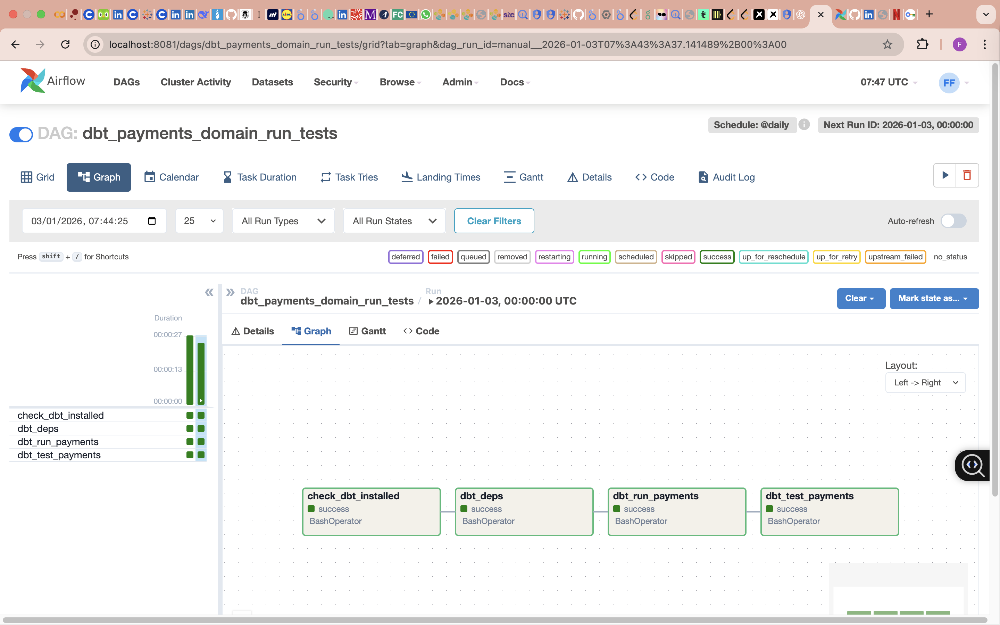

# fintech-data-domain-ownership
Analytics Engineering portfolio proving data modeling (SCD2, star schema), orchestrated dbt pipelines (Airflow DAGs), CI quality gates on PR, and cost-aware warehouse materialization for fintech domains.

## Airflow Orchestration (Local)

This repo includes a local Apache Airflow DAG that orchestrates dbt runs + tests for the Payments domain.

**DAG:** `dbt_payments_domain_run_tests`  
**Tasks:** `check_dbt_installed → dbt_deps → dbt_run_payments → dbt_test_payments`

### Proof (Airflow UI)




### Run Locally (replicable)

**Terminal 1**
```bash
export AIRFLOW_HOME=~/airflow_people_analytics
export DBT_PROJECT_DIR="$(pwd)"
export DBT_BIN="/Users/fatima/dbt_venv/bin/dbt"  # change if needed

airflow db init
airflow webserver --port 8081
